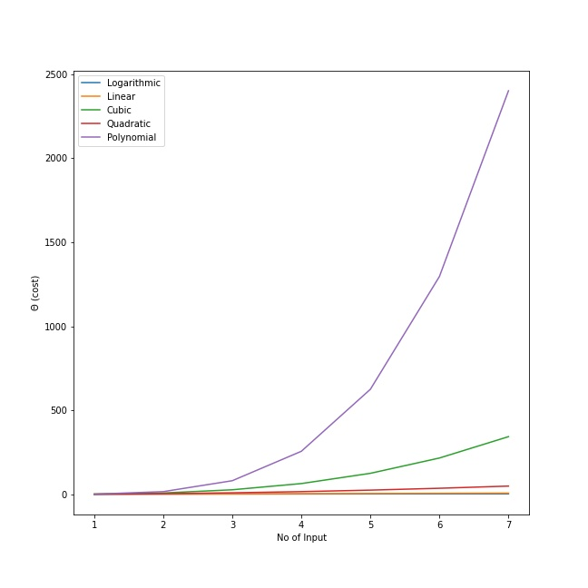

### Given functions
1. **Θ(log n)** 
2. **Θ(n)** 
3. **Θ(n2)** 
4. **Θ(n3)** 
5. **Θ(nk)** 

### Comparison between functions

The plot above depicts the relationship between the change in the y-axis and the change in the x-axis. On the X-axis, we're looking at the number of inputs, and on the Y-axis, we're looking at how long it takes to process output for that input. We can observe that the processing for the function Θ(log n) which is represented by the blue line is faster than all the other functions after calculating and visualizing them. It takes less computation cost to process output as the number of input increases compared other functions.

So **Θ(log n)** is the best solutions. 